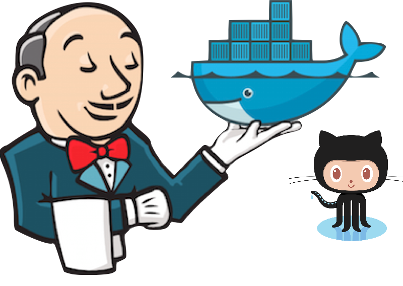
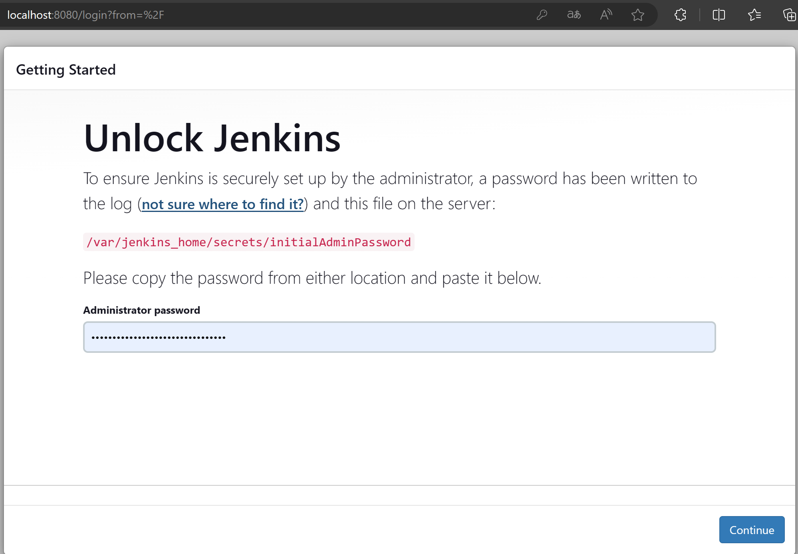
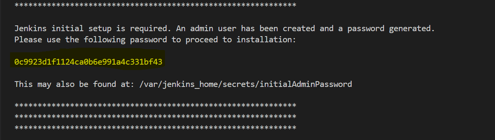
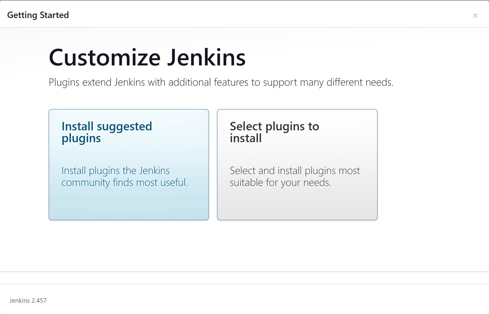
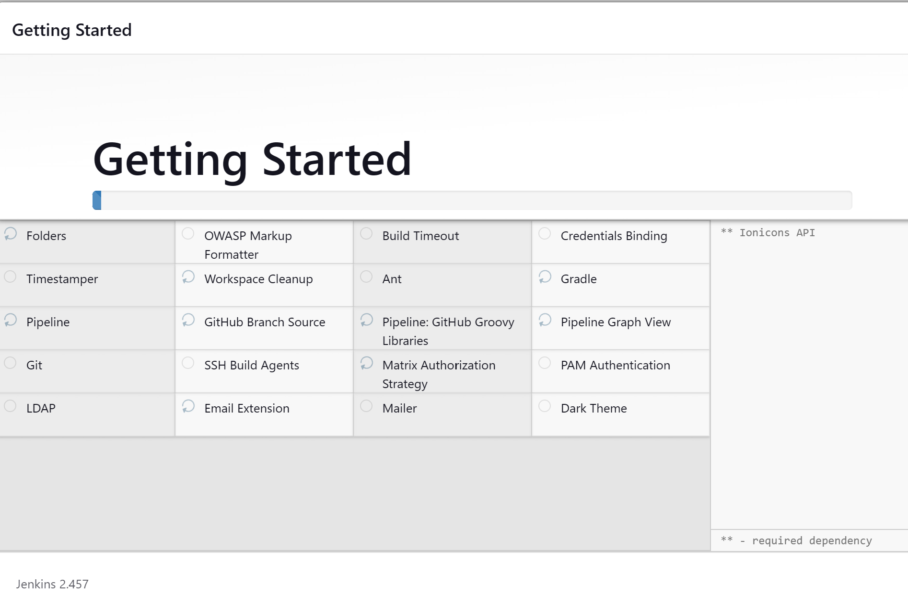
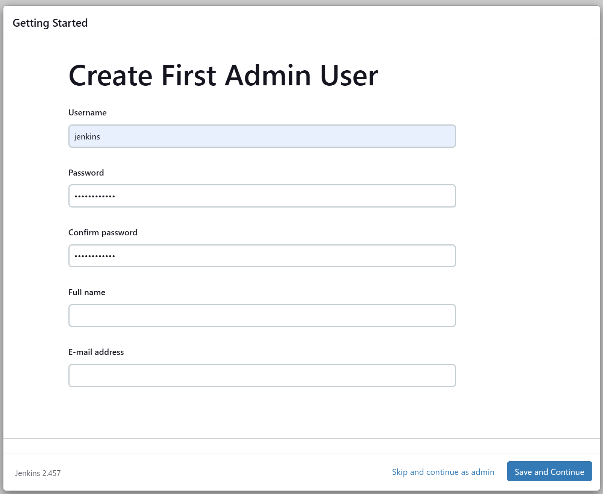
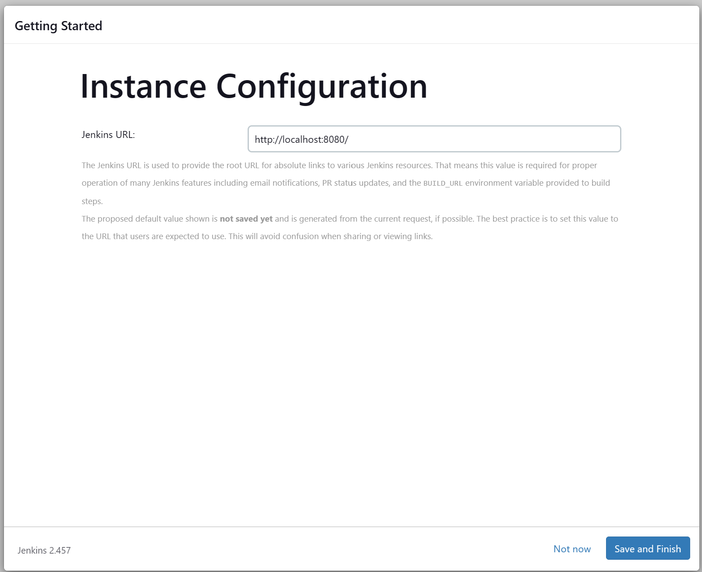
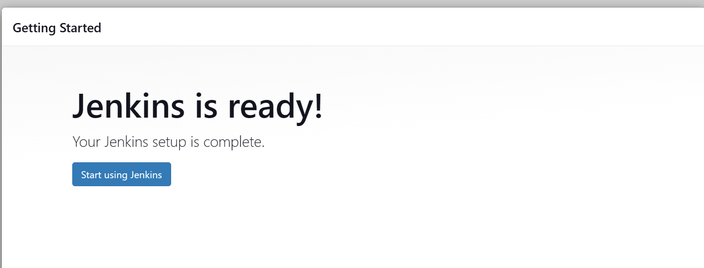
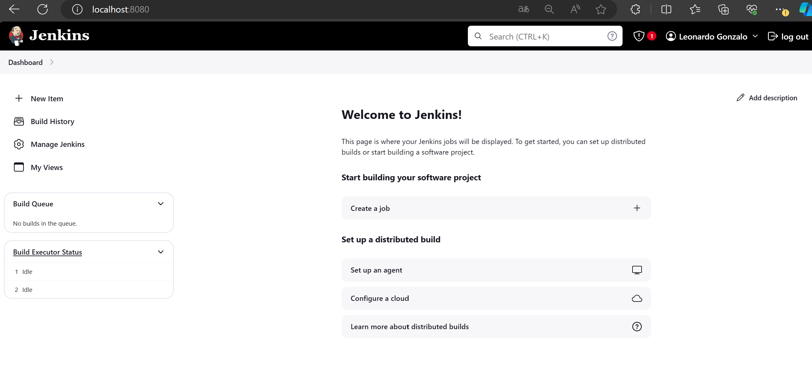

## Devops with docker

### Configuration of resources and containers

#### Before initiating, clone the repository: 

<code> git clone https://github.com/leonardogonzalolaura/devopscourse.git
</code>

#### Step 1: Configure jenkins in a container to perform the following tasks:

- To navigate to the directory **devosp** where project was downloaded and execute the following commands:
  <code> docker build -t jenkins_devops --no-cache .</code>

  then execute:

  <code> docker run -d -p 8080:8080 -p 50000:50000 --name jenkins_container jenkins_devops </code> (review the documentation of the image at https://hub.docker.com/r/jenkins/jenkins/)

#### Step 2: Configure services jenkins 
- To access it in the browser, enter the url **http://localhost:8080/**

- Run <code>docker logs jenkins_container</code> to obtain the password, copy the password and proceed with the configuration of jenkins

- Select the option **Install suggested plugins** 

- Wait while the installation completes

- After completing the installation, create an admin user and provide the required information
  

- In our case,we will use  **http://localhost:8080/** 

- To access jenkins, click on the button **Start using Jenkins**

- The Jenkins dashboard will be shown 

